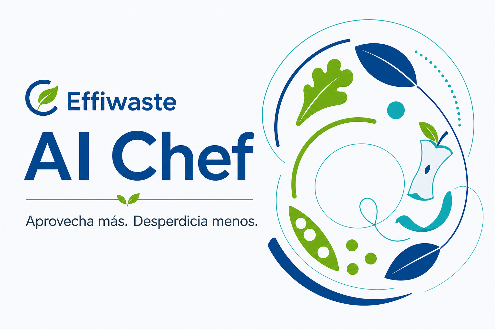
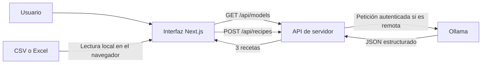

# Circular Chef



**Circular Chef** es un asistente de cocina circular que transforma alimentos sobrantes en tres propuestas de reaprovechamiento detalladas. La aplicación combina una interfaz web en Next.js con un modelo de lenguaje servido por Ollama y está pensada para cocinas profesionales, restauración y entornos donde interesa reducir desperdicio sin perder de vista la trazabilidad y la seguridad alimentaria.

El usuario puede describir los alimentos en lenguaje natural o importar un inventario CSV/Excel, indicar comensales, tiempo disponible, estilo culinario y restricciones, y recibir recetas estructuradas con cantidades, tiempos, temperaturas, elaboración y advertencias de seguridad.

> [!IMPORTANT]
> Las recetas son propuestas generadas por IA. Antes de elaborarlas, el responsable de cocina debe validar ingredientes, alérgenos, conservación, trazabilidad y procedimientos conforme al sistema APPCC del establecimiento.

## Contenido

- [Funcionalidades](#funcionalidades)
- [Cómo funciona](#cómo-funciona)
- [Tecnologías](#tecnologías)
- [Inicio rápido](#inicio-rápido)
- [Uso de la aplicación](#uso-de-la-aplicación)
- [Configuración](#configuración)
- [Despliegue con Docker Compose](#despliegue-con-docker-compose)
- [Despliegue separado: web y Ollama](#despliegue-separado-web-y-ollama)
- [Aplicación de escritorio](#aplicación-de-escritorio)
- [API](#api)
- [Desarrollo y verificación](#desarrollo-y-verificación)
- [Estructura del repositorio](#estructura-del-repositorio)
- [Seguridad y privacidad](#seguridad-y-privacidad)
- [Resolución de problemas](#resolución-de-problemas)

## Funcionalidades

- Generación de **exactamente tres recetas** diferentes a partir de los sobrantes disponibles.
- Entrada mediante texto libre o archivos `.csv` y `.xlsx`.
- Detección automática de separadores CSV: coma, punto y coma o tabulador.
- Previsualización editable del inventario importado antes de generar recetas.
- Ajuste por número de comensales, tiempo máximo, tipo de cocina y restricciones alimentarias.
- Ingredientes cuantificados, preparación previa, tamaño de ración y pasos numerados.
- Tiempos de preparación y cocción, temperaturas o potencias y señales observables del punto correcto.
- Identificación prudente de alimentos que deberían descartarse cuando su uso pueda ser dudoso.
- Indicador de disponibilidad de Ollama y del modelo configurado.
- Ejecución local, despliegue completo con contenedores, despliegue web desacoplado y distribución como aplicación de escritorio.

## Cómo funciona



1. El navegador procesa el texto o la primera hoja del archivo importado.
2. La interfaz valida que cada fila tenga ingrediente, cantidad positiva y unidad.
3. `GET /api/models` comprueba que Ollama responde y que el modelo requerido está instalado.
4. `POST /api/recipes` valida y limita la entrada, construye el prompt culinario y solicita una respuesta JSON a Ollama.
5. El servidor devuelve tres recetas estructuradas; la interfaz presenta ingredientes, pasos, tiempos y avisos.

La comunicación con Ollama siempre se realiza desde el servidor de la aplicación. Su URL y su token no se incluyen en el JavaScript enviado al navegador.

### Modalidades disponibles

| Modalidad | Uso recomendado | Ollama | HTTPS |
| --- | --- | --- | --- |
| Desarrollo local | Programación y pruebas | Instalado en el equipo | No necesario en `localhost` |
| Docker Compose completo | Servidor propio y producción autocontenida | Contenedor privado | Caddy lo gestiona automáticamente |
| Web + Ollama remoto | Vercel u otro hosting para Next.js | Servidor separado | Obligatorio entre servicios |
| Escritorio | Usuarios sin entorno de desarrollo | Incluido en el instalador | No; todo escucha en loopback |

## Tecnologías

- **Next.js 16**, React 19 y TypeScript.
- **Ollama** con `llama3.2:3b` como modelo predeterminado.
- **Electron** y Electron Builder para las aplicaciones de escritorio.
- **Docker Compose** para orquestar Next.js, Ollama y Caddy.
- **Caddy** como proxy inverso y terminación TLS.
- `read-excel-file` para interpretar `.xlsx` en el navegador.
- ESLint y el runner de pruebas nativo de Node.js para calidad y verificación.

La carpeta `db/` conserva un punto de extensión para Drizzle y Cloudflare D1, pero la versión actual no utiliza base de datos ni guarda históricos de recetas.

## Inicio rápido

### Requisitos

- Node.js **22.13 o posterior**.
- npm, incluido con Node.js.
- Ollama instalado y en ejecución.
- El modelo configurado; por defecto, `llama3.2:3b`.

### Instalación local

```bash
git clone URL_DEL_REPOSITORIO
cd AIChef
npm install
ollama pull llama3.2:3b
```

Inicia Ollama si todavía no está activo:

```bash
ollama serve
```

En otra terminal, inicia la aplicación:

```bash
npm run dev
```

Abre [http://localhost:3000](http://localhost:3000). El indicador de la cabecera debería mostrar **Ollama conectado**.

### Ejecución local en modo producción

```bash
npm run build
npm start
```

## Uso de la aplicación

### Entrada en lenguaje natural

Selecciona **Escribir sobrantes** e indica con la mayor precisión posible los productos y cantidades disponibles. Por ejemplo:

```text
Han sobrado 2 kg de tomates maduros, 3 barras de pan del desayuno
y 500 g de queso. Necesito aprovecharlo para el servicio de mañana.
```

Después configura:

- **Comensales:** entre 1 y 100.
- **Tiempo máximo:** duración total permitida para cada receta.
- **Tipo de cocina:** estilo o contexto culinario deseado.
- **Alergias o restricciones:** condiciones que el modelo debe respetar.

### Importación CSV o Excel

Selecciona **Subir CSV / Excel** y carga un `.csv` o `.xlsx`. En Excel se procesa la primera hoja. El formato recomendado es:

| ingrediente | cantidad | unidad |
| --- | ---: | --- |
| Tomate maduro | 2,5 | kg |
| Pan del desayuno | 3 | barras |
| Queso | 500 | g |

También se reconocen encabezados equivalentes:

- Ingrediente: `producto`, `alimento`, `nombre`, `ingredient`, `product` o `name`.
- Cantidad: `peso`, `quantity`, `amount` o `weight`.
- Unidad: `unidad de medida`, `unit` o `measure`.

Si no hay encabezados reconocibles, se interpretan las tres primeras columnas como ingrediente, cantidad y unidad. La importación admite hasta 500 filas. Antes de generar, se puede corregir, añadir o eliminar cualquier ingrediente desde la previsualización.

El archivo se interpreta localmente en el navegador: no se sube el fichero original. Al generar, sí se envía al backend el listado de ingredientes extraído y revisado.

## Configuración

Todas las variables que conectan con Ollama son privadas del servidor. No deben llevar el prefijo `NEXT_PUBLIC_`.

### Variables de la aplicación

| Variable | Valor predeterminado | Descripción |
| --- | --- | --- |
| `OLLAMA_BASE_URL` | `http://127.0.0.1:11434` | URL base de Ollama. Una URL remota debe usar HTTPS. |
| `OLLAMA_MODEL` | `llama3.2:3b` | Modelo que se comprobará y utilizará para generar recetas. |
| `OLLAMA_API_KEY` | — | Token Bearer requerido cuando Ollama está en un host remoto. |
| `OLLAMA_TRUSTED_HOSTS` | — | Hosts internos, separados por comas, autorizados a usar HTTP sin token. El Compose completo utiliza `ollama`. |
| `OLLAMA_ALLOW_INSECURE_HTTP` | `false` | Permite HTTP remoto únicamente cuando vale `true`. Úsalo sólo en redes controladas. |

Ejemplo para utilizar un Ollama remoto:

```bash
OLLAMA_BASE_URL=https://ollama.example.com \
OLLAMA_API_KEY=un-token-largo-y-aleatorio \
OLLAMA_MODEL=llama3.2:3b \
npm run dev
```

En Windows PowerShell, la misma configuración se establece así:

```powershell
$env:OLLAMA_BASE_URL="https://ollama.example.com"
$env:OLLAMA_API_KEY="un-token-largo-y-aleatorio"
$env:OLLAMA_MODEL="llama3.2:3b"
npm run dev
```

La aplicación de escritorio utiliza siempre `llama3.2:3b`; `OLLAMA_MODEL` permite cambiar el modelo en las modalidades web y servidor.

### Variables del despliegue completo

El archivo `.env.example` contiene la configuración de Docker Compose:

| Variable | Obligatoria | Descripción |
| --- | --- | --- |
| `APP_ADDRESS` | Sí | Dominio público de la aplicación o `http://IP` para una prueba sin TLS. |
| `OLLAMA_MODEL` | No | Modelo descargado por `ollama-init`. |
| `OLLAMA_KEEP_ALIVE` | No | Tiempo durante el que Ollama mantiene el modelo cargado. |
| `APP_IMAGE` | No | Nombre o etiqueta de la imagen local de la aplicación. |
| `OLLAMA_IMAGE` | No | Imagen y versión de Ollama. |
| `CADDY_IMAGE` | No | Imagen y versión de Caddy. |
| `COMPOSE_FILE` | No | Permite activar el override de GPU de forma permanente. |

No publiques el archivo `.env` ni tokens reales en el repositorio.

## Despliegue con Docker Compose

Es la opción recomendada para un servidor propio. El conjunto levanta cuatro servicios:

- `caddy`: único servicio publicado; atiende en `80`, `443/tcp` y `443/udp`.
- `app`: aplicación Next.js ejecutada como usuario sin privilegios.
- `ollama`: motor de inferencia accesible sólo desde la red privada `ai-backend`.
- `ollama-init`: tarea de inicialización que descarga el modelo antes de iniciar la web.

Los puertos `3000` y `11434` no se publican en el host.

### Requisitos del servidor

- Linux con Git, Docker Engine y Docker Compose v2.
- DNS del dominio apuntando a la IP pública.
- Puertos TCP `80` y `443`, UDP `443` y el puerto de SSH permitidos en el cortafuegos.
- Espacio suficiente para imágenes, modelo y caché. El primer arranque descarga varios GB.
- Para GPU: controlador NVIDIA y NVIDIA Container Toolkit.

### Primera instalación

```bash
git clone --branch main --single-branch URL_DEL_REPOSITORIO AIChef
cd AIChef
cp .env.example .env
```

Edita `.env` y sustituye el dominio de ejemplo:

```dotenv
APP_ADDRESS=chef.example.com
OLLAMA_MODEL=llama3.2:3b
OLLAMA_KEEP_ALIVE=30m
```

Arranca el sistema:

```bash
docker compose up -d --build
```

La primera ejecución tarda más porque `ollama-init` descarga el modelo en el volumen persistente `ollama-data`. Sigue el progreso y comprueba el estado con:

```bash
docker compose logs -f ollama-init
docker compose ps
docker compose logs --tail=100 app caddy ollama
```

Que `ollama-init` aparezca como `Exited (0)` después de terminar es normal. Caddy solicitará y renovará el certificado automáticamente cuando el DNS y los puertos sean accesibles.

Para una prueba temporal sin dominio se puede usar `APP_ADDRESS=http://IP_DEL_SERVIDOR`. Esa configuración no tiene HTTPS y no es adecuada para producción.

### Aceleración con GPU NVIDIA

```bash
docker compose -f compose.yaml -f compose.gpu.yaml up -d --build
```

También puedes descomentar esta línea de `.env` para que los comandos habituales y el script de actualización apliquen siempre el override:

```dotenv
COMPOSE_FILE=compose.yaml:compose.gpu.yaml
```

### Actualizaciones

Desde la rama `main`, ejecuta:

```bash
./scripts/deploy.sh
```

El script comprueba la rama y la existencia de `.env`, ejecuta un `git pull --ff-only`, actualiza las imágenes auxiliares, reconstruye la aplicación y elimina contenedores huérfanos. El equivalente manual es:

```bash
git pull --ff-only origin main
docker compose pull ollama ollama-init caddy
docker compose up -d --build --remove-orphans
docker compose ps
```

Un `git pull` aislado no actualiza el código que ya está dentro del contenedor.

### Operación habitual

```bash
# Registros en directo
docker compose logs -f

# Reiniciar sin eliminar datos
docker compose restart

# Detener conservando modelo y certificados
docker compose down

# Consultar los modelos instalados
docker compose exec ollama ollama list
```

> [!CAUTION]
> `docker compose down -v` elimina los volúmenes, incluido el modelo descargado y los datos de certificados de Caddy.

## Despliegue separado: web y Ollama

Esta arquitectura permite desplegar Next.js en Vercel u otro proveedor y mantener Ollama en un servidor propio. La conexión entre ambos debe usar HTTPS y un token Bearer.

### 1. Publicar sólo Ollama

La carpeta `deploy/ollama/` contiene un Compose independiente con Caddy, autenticación por token y persistencia.

```bash
cd deploy/ollama
cp env.example .env
openssl rand -hex 32
```

Configura el dominio y copia el token generado:

```dotenv
OLLAMA_DOMAIN=ollama.example.com
OLLAMA_API_KEY=TOKEN_GENERADO
OLLAMA_IMAGE=ollama/ollama:latest
```

Arranca para CPU:

```bash
docker compose up -d
```

O con GPU NVIDIA:

```bash
docker compose -f compose.yaml -f compose.gpu.yaml up -d
```

Descarga el modelo en el volumen persistente y verifica el acceso:

```bash
docker compose exec ollama ollama pull llama3.2:3b

curl -fsS \
  -H "Authorization: Bearer TOKEN_GENERADO" \
  https://ollama.example.com/api/tags
```

Mantén cerrado el puerto `11434`; Caddy debe ser el único punto de entrada.

### 2. Publicar la web

En Vercel, importa el repositorio y define estas variables para los entornos que deban funcionar:

```dotenv
OLLAMA_BASE_URL=https://ollama.example.com
OLLAMA_API_KEY=TOKEN_GENERADO
OLLAMA_MODEL=llama3.2:3b
```

Después realiza un nuevo despliegue. Las rutas `/api/models` y `/api/recipes` se ejecutan en el servidor y la generación declara una duración máxima de 300 segundos; el límite efectivo dependerá del proveedor y del plan contratado.

No habilites `OLLAMA_ALLOW_INSECURE_HTTP` en un entorno público. Tampoco es necesario configurar CORS en Ollama: el navegador llama a la API de Next.js en su propio origen.

## Aplicación de escritorio

La distribución de escritorio incluye Electron, Node.js, la aplicación compilada y los binarios de Ollama. El usuario final no necesita instalar Node.js ni ejecutar comandos.

En el primer inicio, la aplicación:

1. Comprueba si hay una instancia local de Ollama disponible.
2. Si no la hay, inicia el binario incluido escuchando sólo en `127.0.0.1:11434` y deshabilita Ollama Cloud.
3. Descarga `llama3.2:3b` si todavía no está instalado.
4. Inicia el servidor web en un puerto local libre y abre una ventana aislada de Electron.

La primera ejecución requiere conexión a Internet y varios GB de espacio libre. Después, el modelo permanece guardado en el equipo. Los fallos de arranque se registran en `circular-chef.log` dentro de la carpeta de logs de Electron.

### Desarrollo de escritorio

```bash
npm run desktop:dev
```

### Generar artefactos

```bash
# Instaladores para el sistema actual
npm run desktop:dist

# Directorio desempaquetado para pruebas
npm run desktop:package

# Instalador NSIS de Windows x64 desde macOS
npm run desktop:dist:win
```

Los artefactos se escriben en `release/`:

| Plataforma | Formato |
| --- | --- |
| macOS | `.dmg` y `.zip` |
| Windows x64 | instalador NSIS `.exe` |
| Linux x64 | `.AppImage` |

Consideraciones de compilación:

- En macOS se reutiliza `/Applications/Ollama.app` si está disponible; en caso contrario se descarga el paquete oficial.
- Para Windows x64 se descarga una versión fijada de Ollama, se valida mediante SHA-256 y se incorpora al instalador.
- En Linux debe existir Ollama en `/usr/lib/ollama` y `/usr/bin/ollama`, o deben definirse `EFFIWASTE_OLLAMA_RESOURCES` y `EFFIWASTE_OLLAMA_BINARY`.
- Los instaladores destinados a distribución pública deben firmarse. macOS requiere además notarización para evitar avisos de Gatekeeper; Windows requiere un certificado de firma de código para reducir avisos de SmartScreen.

## API

### `GET /api/models`

Comprueba la conexión y que `OLLAMA_MODEL` esté instalado.

Respuesta correcta:

```json
{
  "online": true
}
```

Si Ollama no responde o falta el modelo, devuelve `503` y `online: false`.

### `POST /api/recipes`

Genera las recetas. La ruta sólo acepta solicitudes del mismo origen cuando el navegador envía la cabecera `Origin`.

Ejemplo de cuerpo:

```json
{
  "description": "2 kg de tomate, 500 g de queso y 3 barras de pan",
  "servings": 6,
  "maxTime": 45,
  "restrictions": "sin frutos secos",
  "style": "cocina canaria y mediterránea"
}
```

Límites principales:

| Campo | Límite |
| --- | --- |
| `description` | Obligatorio; máximo 12.000 caracteres |
| `servings` | Entero entre 1 y 100 |
| `maxTime` | Entero entre 10 y 180 minutos |
| `restrictions` | Máximo 1.000 caracteres procesados |
| `style` | Máximo 200 caracteres procesados |

La respuesta contiene `introduction`, `recipes`, `discarded_items` y `closing_tip`. Cada receta incluye título, resumen, tiempos, dificultad, raciones, tamaño de porción, ingredientes, pasos, consejo de aprovechamiento y nota de seguridad.

Estados de error relevantes: `400` para entrada incompleta, `403` para origen no permitido, `413` para una descripción demasiado larga, `502` para una respuesta inválida del modelo y `503` cuando el servicio de IA no está disponible o está mal configurado.

## Desarrollo y verificación

### Scripts disponibles

| Comando | Función |
| --- | --- |
| `npm run dev` | Inicia Next.js en modo desarrollo. |
| `npm run build` | Genera el build standalone de producción. |
| `npm start` | Sirve el build de Next.js. |
| `npm run dev:sites` | Inicia el entorno Vinext utilizado para esa variante del build. |
| `npm run build:sites` | Genera el build Vinext utilizado por el empaquetado de escritorio. |
| `npm run lint` | Ejecuta ESLint. |
| `npm test` | Compila y ejecuta las pruebas web, de Ollama y de Docker. |
| `npm run test:desktop` | Verifica la configuración del empaquetado de escritorio. |
| `npm run db:generate` | Genera migraciones Drizzle si se añade un esquema. |
| `npm run desktop:prepare` | Prepara el build web y Ollama para el sistema actual. |
| `npm run desktop:prepare:win` | Prepara el build web y Ollama para Windows x64. |
| `npm run desktop:dev` | Prepara y abre la aplicación Electron. |
| `npm run desktop:package` | Crea una distribución de escritorio sin instalador. |
| `npm run desktop:dist` | Construye los instaladores del sistema actual. |
| `npm run desktop:dist:win` | Construye el instalador NSIS de Windows x64. |

Antes de integrar cambios:

```bash
npm run lint
npm test
npm run test:desktop
```

La suite valida el flujo completo de recetas, el cliente seguro de Ollama, el aislamiento de red del despliegue, la imagen standalone sin privilegios y el contenido del paquete de escritorio.

## Estructura del repositorio

```text
AIChef/
├── app/                      # Interfaz Next.js y rutas API
│   ├── api/models/           # Comprobación de Ollama y del modelo
│   ├── api/recipes/          # Generación estructurada de recetas
│   └── lib/ollama.ts         # Configuración y cliente de Ollama
├── build/                    # Integración de build con Vinext
├── db/                       # Extensión opcional para Drizzle/D1
├── deploy/
│   ├── docker/Caddyfile      # Proxy del despliegue completo
│   └── ollama/               # Despliegue independiente de Ollama
├── desktop/                  # Proceso principal y recursos de Electron
├── public/                   # Imágenes y recursos estáticos
├── scripts/                  # Despliegue y preparación de binarios
├── tests/                    # Pruebas automatizadas
├── worker/                   # Entrada para el build basado en Vinext
├── compose.yaml              # Stack completo para CPU
├── compose.gpu.yaml          # Override para GPU NVIDIA
├── Dockerfile                # Imagen standalone de Next.js
└── package.json              # Dependencias, scripts y metadatos
```

## Seguridad y privacidad

- El navegador nunca recibe `OLLAMA_BASE_URL` ni `OLLAMA_API_KEY`.
- Los archivos CSV/Excel se leen en el cliente; sólo el inventario normalizado se envía al backend al solicitar recetas.
- El Compose completo separa la red pública de la red de IA y no publica Ollama ni Next.js directamente.
- Las conexiones remotas a Ollama requieren HTTPS y token, salvo hosts internos de confianza o una excepción explícita.
- La imagen de la aplicación se ejecuta con un usuario sin privilegios.
- Electron habilita aislamiento de contexto, desactiva Node.js en la vista, deniega permisos y abre los enlaces externos fuera de la aplicación.
- No existe persistencia de inventarios ni recetas en la versión actual.

La comprobación de mismo origen es una defensa adicional, no un sistema completo de autenticación. Si la aplicación se expone públicamente, añade autenticación, límites de uso, monitorización y las políticas de red adecuadas para evitar consumo no autorizado de la capacidad de inferencia.

## Resolución de problemas

### La interfaz muestra «Ollama sin conexión»

```bash
ollama list
curl http://127.0.0.1:11434/api/tags
```

Comprueba que Ollama está iniciado, que la URL es correcta y que el modelo indicado en `OLLAMA_MODEL` aparece en la lista. Después pulsa de nuevo el indicador de conexión.

### El modelo no está instalado

```bash
ollama pull llama3.2:3b
```

En Docker Compose completo, revisa `docker compose logs ollama-init`. En el despliegue desacoplado, ejecuta el comando dentro del contenedor de Ollama.

### Una URL remota es rechazada

Los hosts remotos deben usar `https://` y tener `OLLAMA_API_KEY`. Reserva `OLLAMA_ALLOW_INSECURE_HTTP=true` para redes privadas y pruebas controladas.

### La generación termina por tiempo de espera

Revisa la carga y los logs de Ollama, confirma que el servidor tiene memoria suficiente y comprueba el límite de ejecución del proveedor web. La API espera hasta 285 segundos la respuesta de Ollama.

### Caddy no obtiene el certificado

Verifica que `APP_ADDRESS` u `OLLAMA_DOMAIN` coincide con el DNS público y que los puertos `80` y `443` llegan al servidor. Consulta los detalles con `docker compose logs caddy`.

### El instalador de escritorio muestra una advertencia

Los artefactos locales no están firmados por defecto. Para distribución pública, configura las credenciales de firma y notarización compatibles con Electron Builder.

## Licencia

Este repositorio no incluye actualmente un archivo `LICENSE`. Hasta que se añada uno, el uso, modificación y redistribución requieren autorización de la persona o entidad titular del proyecto.
